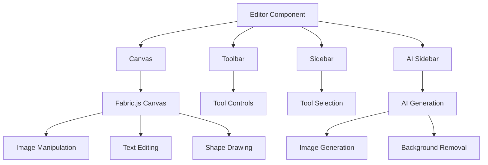
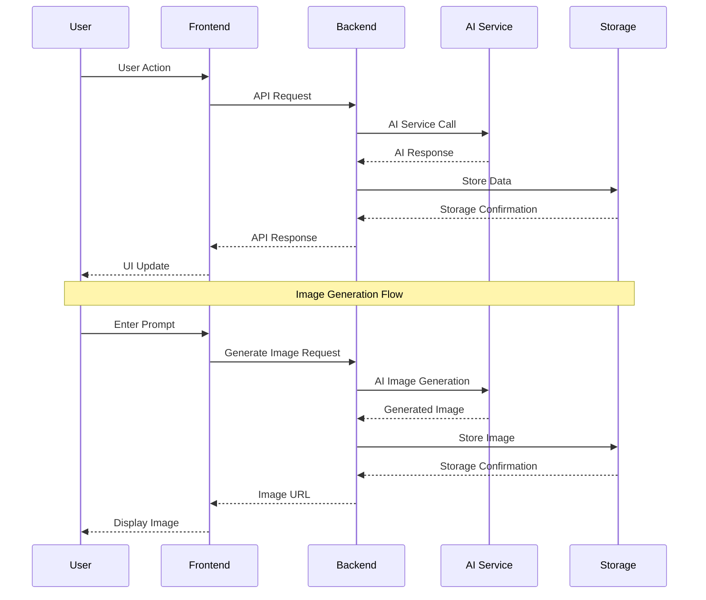
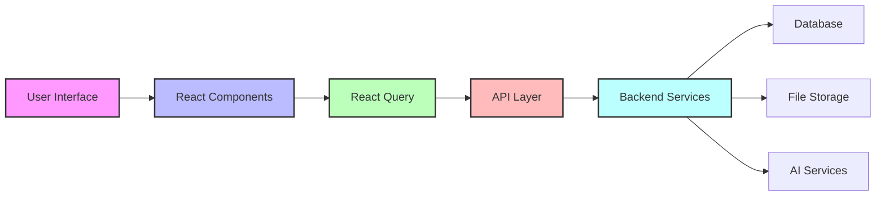

# ShiniGami Designs

A modern, feature-rich image editor built with Next.js and TypeScript, inspired by Canva's design interface. This application provides a powerful yet intuitive interface for image editing, manipulation, and design creation.

## 🚀 Features

- **Editor**: Interactive canvas for image manipulation
- **AI Integration**: AI-powered image generation
- **Image Management**: Upload, edit, and manage images
- **Text Tools**: Rich text editing capabilities
- **Shape Tools**: Add and manipulate various shapes
- **Drawing Tools**: Free-hand drawing capabilities
- **Filters**: Apply various image filters
- **Background Removal**: AI-powered background removal
- **Export Options**: Export in multiple formats (PNG, JPG, SVG, JSON)
- **Responsive Design**: Mobile-friendly interface

## 🛠 Tech Stack

### Frontend

- **Framework**: Next.js 15 with TypeScript , Honojs.
- **UI Library**: React
- **State Management**: Tanstack Query , Zustand
- **Styling**: Tailwind CSS ,
- **Canvas Library**: Fabric.js
- **Icons**: Lucide Icons, React Icons
- **UI Components**: Custom components with shadcn/ui
- **Font**: Geist (optimized with next/font)

### Backend

- **API**: RESTful API with Hono
- **Authentication**: Custom auth system
- **File Storage**: Uploadthing for file management
- **AI Integration**: External AI APIs for image generation and background removal

## 📁 Project Structure

```
canva/
├── src/
│   ├── app/                 # Next.js app directory
│   ├── components/
│   │   └── ui/             # Reusable UI components
│   ├── features/
│   │   ├── editor/         # Canvas editor implementation
│   │   ├── auth/           # Authentication
│   │   ├── ai/             # AI integration
│   │   ├── images/         # Image management
│   │   └── projects/       # Project management
│   ├── lib/                # Utility functions
│   └── types/              # TypeScript type definitions
├── public/                 # Static assets
└── package.json           # Project dependencies
```

## 🔄 Component Architecture



## 🔄 API Flow Architecture



## 🔄 Data Flow Architecture



## 🔧 Core Components

### Editor

The main editor component that orchestrates all other components and manages the canvas state.

### Canvas

- Built with Fabric.js
- Handles all image manipulation
- Manages object selection and transformation
- Supports undo/redo operations

### Toolbar

- Provides quick access to common tools
- Context-sensitive based on selected object
- Includes text formatting, alignment, and styling options

### Sidebar

- Tool selection panel
- Contains various editing tools:
  - Design templates
  - Image upload
  - Text tools
  - Shape tools
  - Drawing tools
  - AI tools
  - Settings

### AI Integration

- Image generation from text prompts
- Background removal
- Filter application

## 🔄 Component Interaction

1. **User Actions Flow**:

   - User selects a tool from the Sidebar
   - Toolbar updates to show relevant options
   - Canvas responds to tool selection
   - Changes are reflected in real-time

2. **State Management**:

   - Editor maintains global state
   - Components communicate through props
   - React Query handles API interactions
   - Fabric.js manages canvas state

3. **Data Flow**:
   - User input → Component → State update → Canvas update
   - API calls → State update → UI update
   - Canvas changes → State sync → Save to backend

## 🎨 UI/UX Features

- Minimalistic design with clear visual hierarchy
- Responsive layout for all screen sizes
- Intuitive tool organization
- Real-time preview of changes
- Smooth transitions and animations
- Consistent styling across components

## 🔒 Security

- Secure file uploads
- API key management
- User authentication
- Protected routes
- Safe data handling

## 🚀 Getting Started

1. Clone the repository
2. Install dependencies:
   ```bash
   npm install
   ```
3. Set up environment variables:
   ```env
   NEXT_PUBLIC_API_URL=your_api_url
   NEXT_PUBLIC_UPLOADTHING_APP_ID=your_uploadthing_id
   AI_API_KEY=your_ai_api_key
   ```
4. Run the development server:
   ```bash
   npm run dev
   ```
5. Open [http://localhost:3000](http://localhost:3000) with your browser

## 📝 License

This project is licensed under the MIT License - see the LICENSE file for details.

## 🔗 Additional Resources

- [Next.js Documentation](https://nextjs.org/docs)
- [Fabric.js Documentation](http://fabricjs.com/docs/)
- [Tailwind CSS Documentation](https://tailwindcss.com/docs)
- [React Query Documentation](https://tanstack.com/query/latest)
